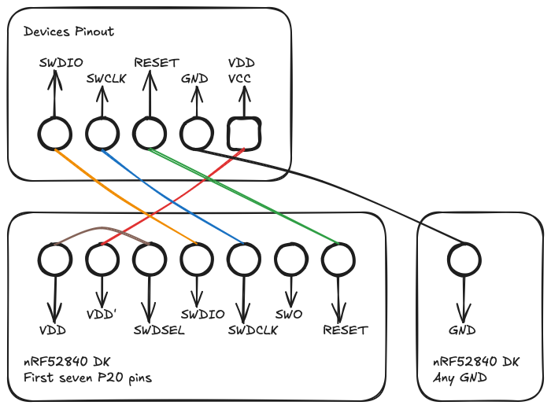

# OpenVSH

OpenVSH is an open-source firmware for [Vimar Smart Home](https://www.vimar.com/en/int/smart-home-15487122.html) devices. It uses the Zigbee standard for device control and Bluetooth Low Energy (BLE) for Firmware Over-The-Air (FOTA) updates and configurations. The firmware is written using [Zephyr OS](https://docs.zephyrproject.org/latest/introduction/index.html) and the [NRF Connect SDK](https://docs.nordicsemi.com/bundle/ncs-latest/page/nrf/index.html).

## History and Motivation

I have a [Vimar Smart Home](https://www.vimar.com/en/int/smart-home-15487122.html) system installed in my home, primarily chosen for its compatibility with the Zigbee standard. However, the functionality of the products is quite limited. For example, on the [2-way switch](https://www.vimar.com/en/int/catalog/product/index/code/19592.0), it's impossible to customize the status LED, the [rolling shutter](https://www.vimar.com/en/int/catalog/product/index/code/19594.0) is cumbersome to configure, and some features are entirely lost on the [thermostat](https://www.vimar.com/en/int/catalog/product/index/code/02973.B). I decided to purchase their [gateway](https://www.vimar.com/en/int/catalog/product/index/code/19597.B) and switched all devices to Bluetooth mode, but this turned out to be slow and required internet access for commands sent from their app, even when I'm inside the house.

Frustrated with these issues, I opened one of the devices and discovered that it uses the [Nordic Semiconductor nRF52840 SoC](https://www.nordicsemi.com/Products/nRF52840). I then purchased the [development kit](https://www.nordicsemi.com/Products/Development-hardware/nRF52840-DK) and rewrote the firmware for the 2-way switch. Fortunately, Vimar's boards conveniently expose the [SWD pins](https://wiki.segger.com/Target_Interface_SWD) needed to completely rewrite the chip's memory. After some testing, I was able to identify and use them to apply the new firmware. I have since decided to rewrite the firmware for all the devices I have, using Zigbee standard. Why Zigbee? I tested Matter over Thread, but it unfortunately requires more flash memory than what is available on the SoC, and the boards lack external flash memory.

## Supported Devices

| Vimar product name / code                                                   | OpenVSH device name | Status      |
| --------------------------------------------------------------------------- | ------------------- | ----------- |
| 2-way switch IoT connected mechanism (14592, 16492, 19592, 20592, 30802)    | On/Off Light        | Beta        |
| Rolling shutter IoT connected mechanism (14594, 16494, 19594, 20594, 30804) | Window Covering     | Planned     |
| IoT dial thermostat 2M (02973, 30810)                                       | Thermostat          | Planned     |
| IoT connected dimmer mechanism 220-240V (14595, 19595, 20595, 30805)        | Dimmable Light      | Not Planned |
| 16 A IoT connected actuator grey (14593, 16493, 19593, 20593, 30803)        |                     | Not Planned |

## Flashing

Before flashing the device, you need to either [build the firmware](#building) or download the hex file for your device from the [latest release](https://github.com/alessiodionisi/openvsh/releases/latest). To flash the firmware, you'll need an SWD-compatible debug probe. Covering all use cases would be impossible, but below you'll find a brief guide explaining how to use SEGGER J-Link Debug Probes and the one included on the [nRF52840 DK](https://www.nordicsemi.com/Products/Development-hardware/nRF52840-DK).

**In any case, this operation only needs to be done once, as future updates will be handled via Firmware Over-The-Air (FOTA) using Bluetooth Low Energy (BLE).**

### Devices Pinout


### SEGGER J-Link Debug Probes

To connect the [SEGGER J-Link](https://www.segger.com/products/debug-probes/j-link) to an SWD connector, follow the pinout mentioned in the [official documentation](https://www.segger.com/products/debug-probes/j-link/technology/interface-description/#swd-and-swo-also-called-swv-compatibility).

Once the debug probe is connected, you need to download the [SEGGER J-Link Software](https://www.segger.com/downloads/jlink). You can then use the `JLinkExe` command line tool to flash the device.

Create a script file `flash.jlink`:

```
Reset
LoadFile /path/to/your/file.hex
Reset
Go
Quit
```

Execute `JLinkExe` to flash the device:

```
JLinkExe -Device <DeviceName> -If SWD -speed 4000 -AutoConnect 1 -NoGui 1 -CommandFile flash.jlink
```

### nRF52840 DK On-Board SEGGER J-Link

To flash the device using the SEGGER J-Link included on the [nRF52840 DK](https://www.nordicsemi.com/Products/Development-hardware/nRF52840-DK) ([documented here](https://docs.nordicsemi.com/bundle/ncs-latest/page/zephyr/develop/flash_debug/nordic_segger.html)), you need to use the P20 connector ([documented here](https://docs.nordicsemi.com/bundle/ug_nrf52840_dk/page/UG/dk/ext_programming_support.html)). The pins to connect are the same as with any SWD-compatible debug probe: "SWDIO", "SWDCLK", and "RESET". You also need to use "VDD nRF" and any "GND" pin from the board (for example, the one on the P17 connector) to power the device. Additionally, you need to connect "SWDSEL" to another "VDD nRF" to signal to the board that an external device is connected. This ensures that any command issued using SEGGER J-Link tools will be directed to the device rather than the board. Below is a diagram showing how to connect them:



Once the debug probe is connected, follow the last part of the [SEGGER J-Link Debug Probes](#segger-j-link-debug-probes) section, replacing `DeviceName` with `NRF52840_XXAA`. Alternatively, if you have installed the [nRF Command Line Tools](https://www.nordicsemi.com/Products/Development-tools/nrf-command-line-tools), you can use `nrfjprog`:

```
nrfjprog --program /path/to/your/file.hex --chiperase --verify --reset
```

## Firmware Over-The-Air (FOTA) Update

_Docs coming soon._

## Building

_Docs coming soon._
